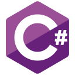

### Hi there, I'm Camil 👋

## I'm a Researcher and Developer!

- 🔭 I'm currently researching in the fields of XR: [Research Gate Profile][researchgate]

 

### Languages and Tools:

 
 

---

[website]: https://pogolski.de
[linkedin]: https://linkedin.com/in/camil-pogolski
[researchgate]: https://www.researchgate.net/profile/Camil_Pogolski